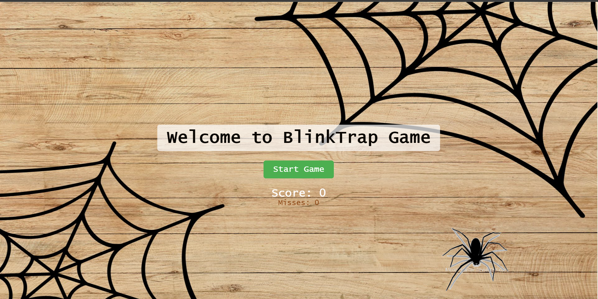
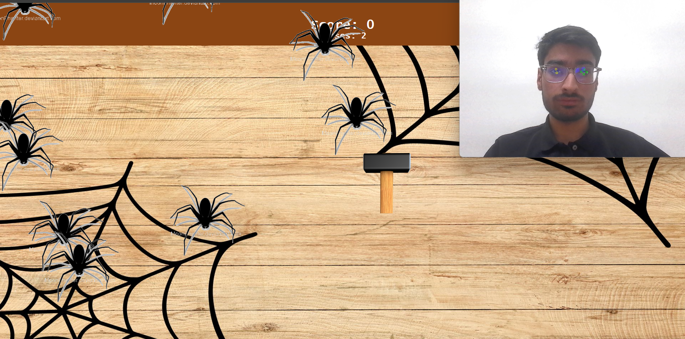
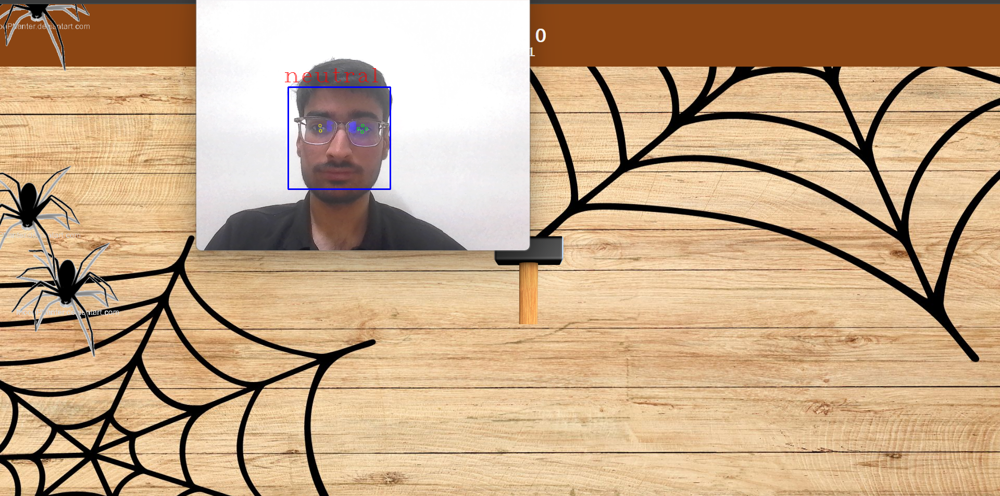

# Blynk-Trap
<h2>Problem Statement:</h2>
Differently abled individuals, particularly physically handicapped, encounter numerous challenges in their daily lives, including participating in digital activities and online gaming. Their limitations in using their hands or legs while maintaining normal vision can lead to feelings of disability, reduced self-confidence, and a sense of exclusion from their peers. However, these individuals share the same desire as others to engage in age-appropriate games. 
<h2>Abstract:</h2>
This project presents an innovative web-based game designed specifically to address the entertainment needs of individuals with physical disabilities, who often face limitations in using their hands or legs. The primary objective is to provide an inclusive gaming experience, allowing users to control the in-game cursor through eye movements. It also caters to individuals without physical disabilities who desire a relaxed and hands-free gaming experience, enhancing its versatility and appeal. 
<h2>Getting Started:</h2>

1. Clone the repository to your local machine:
  ```bash
  git clone https://github.com/ShauryaMalhan/Blynk-Trap.git
  ```
2. Navigate to the project directory:
  ```bash
  cd Blynk-Trap
  ```
3. Install the required dependencies:
  ```
  npm install
  ```
4. Start the application:
  ```
  node index.js
  ```

The application will be accessible in your web browser at http://localhost:3000. You can now begin using the app to play the game.



1. Now after you are on the home page you can start the game by just clicking on start and begin the experience of playing the game just by eyes. All you need to do id kill the spiders by blinking your eyes and score 10 points but if you miss 5 times you will loose the game.



2. This application also offers User Experience which helps user see their emotions while playing the game.



<h2>Contributing: </h2>
  We welcome contributions from the community to improve and enhance the WebApp. If you would like to contribute, please follow these steps:

  Fork the repository.
  1. Create a new branch for your feature or bug fix.
  2. Make your changes and commit them.
  3. Push your changes to your fork.
  4. Create a pull request to the main repository.
     
  Our team will review your pull request, and if accepted, your changes will be incorporated into the WebApp.
